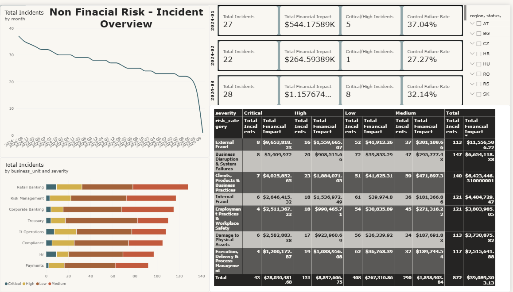
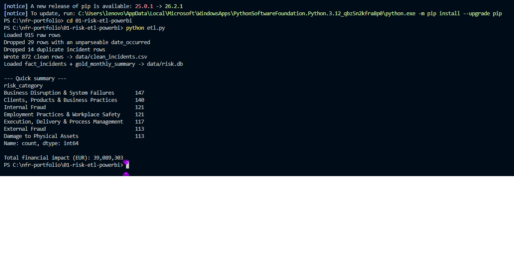

# Project 1 — Non-Financial Risk Incident ETL Pipeline + Power BI Dashboard

An end-to-end pipeline that takes a messy operational-risk incident export,
cleans and enriches it with Python, stores it in SQLite, and surfaces it in
an interactive Power BI dashboard for risk monitoring.

The problem. Incident data exported from a source system is never clean: dates come in mixed formats, categories are typed inconsistently, financial impact is sometimes missing, and re-running an export duplicates rows. Anyone building a risk report by hand spends most of their time fixing these before analysis starts — and repeats it every month. This project makes that cleanup a reproducible script and puts the result straight into a dashboard, so the monthly reporting cycle becomes "run the pipeline, refresh Power BI."




## The data

The incident register is synthetic but modeled on how banks actually
classify Non-Financial Risk: every incident carries a Basel operational-risk
event type (Internal Fraud, External Fraud, Business Disruption & System
Failures, Execution/Delivery & Process Management, etc.), a Level-2
sub-category, a business unit, a CEE region code (AT, CZ, SK, HU, RO, HR,
RS, BG), severity, financial impact in EUR, status and resolution time.

`generate_data.py` produces the raw export with the kind of defects a real
source system delivers: inconsistent casing and whitespace, invalid dates
(`31/02/2025`), missing financial-impact values, blank report dates, and
duplicate rows from a double export.

## The pipeline (`etl.py`)

| Step | What happens |
| --- | --- |
| Normalize | Trims whitespace, maps categories case-insensitively onto the canonical Basel taxonomy, title-cases business units |
| Validate dates | Parses both date columns, drops rows whose occurrence date can't be parsed, back-fills missing report dates |
| Impute | Missing `financial_impact_eur` is filled with the median for that risk category + severity, rather than dropped |
| Deduplicate | Removes repeated `incident_id` rows |
| Enrich | Adds `severity_score`, `reporting_lag_days`, `month`, `quarter`, `age_days`, and an `aging_bucket` (0–7 / 8–30 / 31–90 / 90+ days) |
| Load | Writes `data/clean_incidents.csv` and a SQLite database with a `fact_incidents` table plus a pre-aggregated `gold_monthly_summary` |

Result of a run: 915 raw rows → 872 clean incidents (29 unparseable dates
dropped, 14 duplicates removed), EUR 39.1M total financial impact.



## The dashboard (`nfr_dashboard.pbix`)

Built on the clean CSV with a dedicated date table and these DAX measures:

| Measure | Definition |
| --- | --- |
| Total Incidents | `COUNTROWS(clean_incidents)` |
| Total Financial Impact | `SUM(clean_incidents[financial_impact_eur])` |
| Critical/High Incidents | `CALCULATE([Total Incidents], severity IN {"High","Critical"})` |
| Control Failure Rate | Share of incidents where a control failed |
| Avg Resolution Days | Average resolution time over closed incidents |
| MoM Change % | Month-over-month change in incident count via `DATEADD` on the date table |

The page combines KPI cards, a monthly trend line, incidents by business
unit stacked by severity, a risk-category × severity matrix with counts and
financial impact, and slicers for region, status and month.

## SQL (`analysis_queries.sql`)

Five queries against `data/risk.db`: financial impact by category, monthly
trend of high-severity incidents, business-unit × severity breakdown, open
incidents with control failures ranked by age, and average resolution time
per category.

```bash
sqlite3 data/risk.db < analysis_queries.sql
```

## Reproduce

```bash
pip install pandas numpy
python generate_data.py   # -> data/raw_incidents.csv
python etl.py             # -> data/clean_incidents.csv, data/risk.db
```
Then open `nfr_dashboard.pbix` in Power BI Desktop, or import
`data/clean_incidents.csv` into a new report.

## Files

| File | Purpose |
| --- | --- |
| `generate_data.py` | Synthetic raw incident export with realistic data-quality defects |
| `etl.py` | Cleaning, enrichment, CSV + SQLite output |
| `analysis_queries.sql` | Example analysis queries |
| `nfr_dashboard.pbix` | Power BI report |
| `dashboard.png`, `etl_output.png` | Screenshots of the dashboard and a pipeline run |
| `data/` | Raw and clean CSVs, SQLite database |
