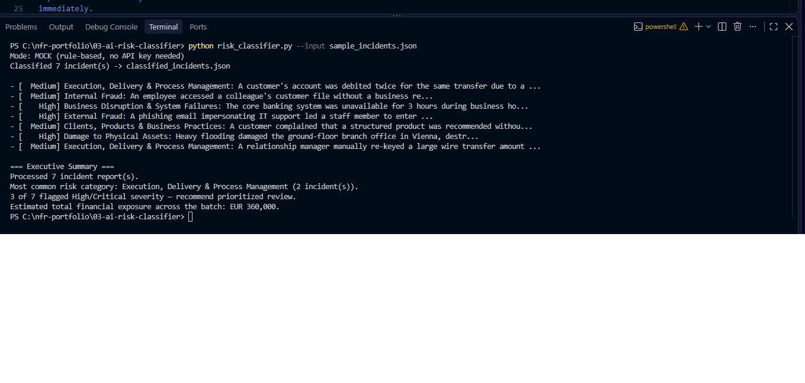

# Project 3 — AI-Powered Risk Report Classifier & Summarizer


The problem. Incident reports arrive as free text. Someone has to read each one and decide its risk category, severity and urgency before it can be counted, trended or escalated — a bottleneck that delays everything downstream and produces inconsistent classifications between reviewers. This tool uses an LLM to draft that classification instantly and consistently, as structured data, so a risk analyst reviews suggestions instead of starting from a blank form.


A Python tool that reads free-text incident descriptions — the kind an
employee types into an incident form — and turns them into structured
Non-Financial Risk data using an LLM.


For each description it returns a Basel operational-risk category, a
severity (Low / Medium / High / Critical), an estimated financial impact, a
recommended action, the key entities mentioned, and a one-line rationale.
Across a batch it adds an executive summary: the dominant category, how many
incidents need prioritized review, and the total estimated exposure.

Output is structured JSON rather than a bare label, so it can feed a
database or a dashboard (for example the `risk.db` from Project 1) instead
of stopping at a classification demo.

## Two modes

**Mock mode (default)** — a small rule-based classifier with no external
dependencies or API key. It exists so the tool runs and can be demonstrated
immediately.

**Live mode** (`--live`) — sends each description to an LLM (Anthropic, or
OpenAI if that key is set instead) with a system prompt that constrains the
answer to the Basel taxonomy and a fixed JSON schema. If the call fails for
any reason, the tool warns and falls back to mock mode instead of crashing.

## Usage

```bash
# mock mode, nothing to install
python risk_classifier.py --input sample_incidents.json

# a single incident
python risk_classifier.py --text "A hacker used a stolen card to make fraudulent purchases at an ATM."

# live mode
pip install anthropic            # or: pip install openai
export ANTHROPIC_API_KEY=...     # or OPENAI_API_KEY
python risk_classifier.py --input sample_incidents.json --live
```

Results are written to `classified_incidents.json`.

## Sample run (mock mode, 7 incidents)

```
- [  Medium] Execution, Delivery & Process Management: A customer's account was debited twice...
- [  Medium] Internal Fraud: An employee accessed a colleague's customer file without...
- [    High] Business Disruption & System Failures: The core banking system was unavailable...
- [    High] External Fraud: A phishing email impersonating IT support...
- [  Medium] Clients, Products & Business Practices: A customer complained that a structured product...
- [    High] Damage to Physical Assets: Heavy flooding damaged the ground-floor branch office...
- [  Medium] Execution, Delivery & Process Management: A relationship manager manually re-keyed...

=== Executive Summary ===
Processed 7 incident report(s).
Most common risk category: Execution, Delivery & Process Management (2 incident(s)).
3 of 7 flagged High/Critical severity — recommend prioritized review.
Estimated total financial exposure across the batch: EUR 360,000.
```

## Limitations and next steps

This is a working prototype, not a validated classifier. Before relying on
it for real reports it would need a hand-labeled evaluation set to measure
per-category accuracy, and review of disagreements with a risk analyst.
Natural extensions: a small Streamlit front-end for non-technical users,
and writing results directly into the Project 1 database so new incidents
appear in the Power BI dashboard automatically.

## Files

| File | Purpose |
| --- | --- |
| `risk_classifier.py` | The tool — mock and live modes, batch summary |
| `sample_incidents.json` | Seven sample incident descriptions |
